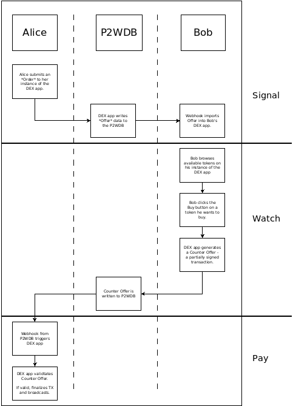

# AVAX DEX Summary
In 2021, [Ava Labs](https://www.avalabs.org/) awarded a grant to the [Permissionless Software Foundation](https://psfoundation.cash/) to develop a decentralized exchange (DEX) for the AVAX X-Chain. This report captures the progress that was made as a result of that grant.

## Scope
The application for the grant included [this presentation to Shapeshift DAO](https://youtu.be/XNvGjH57wdc), and this [proof of concept code](https://gist.github.com/christroutner/ac8810146ee3664c4ee8d6cb8bd66afe). The goal was to port the [SWaP protocol](https://github.com/vinarmani/swap-protocol) created by Vin Armani ([video presentation](https://youtu.be/jypfYJkdJ1k)) to the X-Chain. This protocol allows on-chain trading of tokens, peer-to-peer, with no intermediary. The protocol is *trustless*, meaning neither party can gain an advantage of the other. It is also *atomic*, meaning the trade is either complete or not. There is no in-between state where the trade can get stuck.

The scope of the grant was to create a graphical user interface (GUI) for trading tokens on the X-Chain, leveraging the SWaP protocol. At the start it was simply a proof-of-concept. The GUI now exists and functions, but additional funding will be required to improve the current user experience.

## Challenges
- Financial
  - Unprepared for the structure of the grant, half up front half at the end.
  - Drop in crypto prices
- Dependencies
  - AvalanchJS no longer compiles with Browserify
  - Full node change from cb58 to hex broke a lot of code

## Introduction to SWaP Protocol
SWaP is an acronym that stands for *Signal, Watch, and Pay*. These are the three primary phases of the protocol. A workflow diagram illustrates the phases below. It describes how to users, Alice and Bob, complete a token trade with one another.

